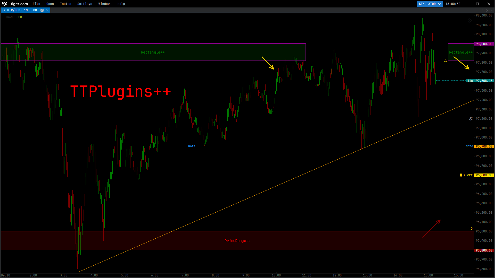
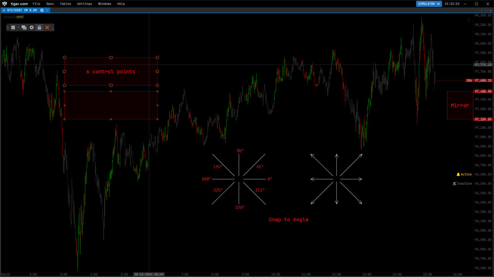
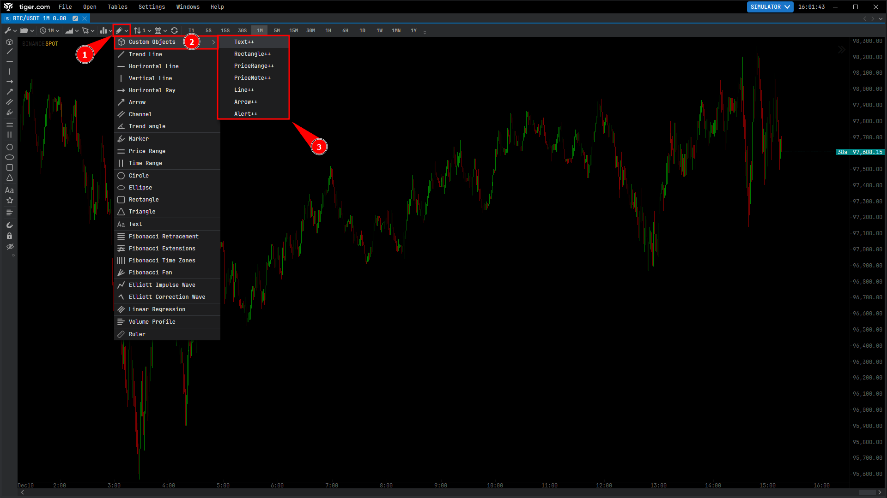

# TTPlugins

TTPlugins is a curated collection of performant and feature rich `Indicator`
and `Object` plugins designed to work with [Tiger.com (aka TigerTrade)][1].

The primary goal of this project is to help people overcome the most common
issues and limitations found in [Tiger.com (aka TigerTrade)][1]'s default
indicators and objects.

Most of the plugins are considered stable and can be used as a complete
replacement for their default counterparts (if any). Note that the plugins were
developed to work with [Tiger.com (aka TigerTrade)][1] `v6.9.9026.42262` and
they may break with older or newer releases, so you could still encounter
unwanted behaviors or bugs.


> [!TIP]
> If you like the project consider sharing it with others or leaving a star.







## Installation

<details open>
<summary>Auto</summary>

### Fastest Way
1. Open `Windows PowerShell`.
2. Copy and paste the following command:
    ```pwsh
    Invoke-Expression (Invoke-RestMethod -Uri "https://raw.githubusercontent.com/TTPlugins/TTPlugins/main/Scripts/installer.ps1")
    ```
3. Press `ENTER` to execute the command.
4. Restart [Tiger.com (aka TigerTrade)][1] and enjoy.

### Alternative Way
1. Download the `installer.ps1` file from the latest release.
2. Execute the `installer.ps1` file *(double click on the file)*.
3. Restart [Tiger.com (aka TigerTrade)][1] and enjoy.

> The script just automates the manual installation and if you do not trust it
> you can open it with any editor to see the commands that it executes.
</details>

<details>
<summary>Manual</summary>

1. Download the `Indicators++.dll` and `Objects++.dll` files from the
   latest release.
2. Open `File Explorer` and go to your `Documents` folder.
3. Create the `TigerTrade` folder *(if missing)*.
4. Go inside the `TigerTrade` folder.
5. Create the `Indicators` and `Objects` folders *(if missing)*.
6. Move the `Indicators++.dll` file inside the `Indicators` folder.
7. Move the `Objects++.dll` file inside the `Objects` folder.
8. Restart [Tiger.com (aka TigerTrade)][1] and enjoy.

It should look like this:

```
C:\Users\<your-user>\Documents\
└─ TigerTrade\
   ├─ Indicators\
   │  └─ Indicators++.dll
   └─ Objects\
      └─ Objects++.dll
```

> You may need to create the folders manually if they are missing.
</details>

> [!NOTE]
> To update the plugins just repeat the installation process.


## Indicators

<details>
<summary>Price++</summary>

### Price++

The `Price++` indicator is a simpler and more performant version of the `Price`
indicator with the following features:

- High performance, optimized rendering.
- Pretty bar statistics (on `CTRL` pressed):
    - High *(optionally the low to high bar size in % if positive)*
    - Low *(optionally the high to low bar size in % if negative)*
    - Open
    - Close
    - Volume
- Readable and intuitive countdown timer attached to the price line.
- Customizable exchange name and exchange type in the top left corner.

> :warning: The alerts of [Tiger.com (aka TigerTrade)][1]'s default objects may
> not work properly with this indicator.
</details>

<details>
<summary>Trading++</summary>

### Trading++

The `Trading++` indicator provides a specific set of features meant to
accelerate some common trading operations:

- Quick measurement of stop and take profits (Toggle with: `S` key).
- Realtime statistics of the open position (if any):
    - PnL value ($)
    - PnL percent (%)
    - PnL ticks
    - PnL ratio (r)
- Automatic price lines for the open position (if any):
    - Average entry price
    - Stop loss price
    - Take profit prices
- Integrated calculator for ideal position size/value based on the
  predefined risk.

> :warning: This indicator is experimental and may not always work properly
> because of the way the trading data is handled internally.
</details>

<details>
<summary>Delta++</summary>

### Delta++

> :warning: If you are not using the `ClusterSearch` (Type: Delta) indicator
> ignore this indicator.

The `Delta++` indicator is a more advanced and performant version of the
`ClusterSearch` indicator focused on the delta data type.
</details>


## Objects

<details>
<summary>Rectangle++</summary>

### Rectangle++
The `Rectangle++` object is a more advanced version of the `Rectangle` object.

### Behavioral Features
- 6 [Advanced Control Points](#advanced-control-points)
- [Advanced Move/Edit Object](#advanced-moveedit-object)

### Functional Features
- Price Scale Labels
- [Quick Timeframe Visibility Switcher](#quick-timeframe-visibility-switcher)
- [Advanced Text](#advanced-text)
- [Advanced Alert](#advanced-alert)
- [Mirror](#mirror)
- [Frozen Coordinates System](#frozen-coordinates-system)
</details>

<details>
<summary>Line++</summary>

### Line++
The `Line++` object is a more advanced version of the `Trend Line` object.

### Behavioral Features
- 2 [Advanced Control Points](#advanced-control-points)
- [Advanced Move/Edit Object](#advanced-moveedit-object)
- [Advanced Snap to Angles](#advanced-snap-to-angles)

### Functional Features
- Price Scale Labels
- Extend Start/End
- [Quick Timeframe Visibility Switcher](#quick-timeframe-visibility-switcher)
- [Advanced Text](#advanced-text)
- [Advanced Alert](#advanced-alert)
- [Mirror](#mirror)
- [Frozen Coordinates System](#frozen-coordinates-system)
</details>

<details>
<summary>Arrow++</summary>

### Arrow++
The `Arrow++` object is a more advanced version of the `Arrow` object.

### Behavioral Features
- 2 [Advanced Control Points](#advanced-control-points)
- [Advanced Move/Edit Object](#advanced-moveedit-object)
- [Advanced Snap to Angles](#advanced-snap-to-angles)

### Functional Features
- Price Scale Labels
- [Quick Timeframe Visibility Switcher](#quick-timeframe-visibility-switcher)
- [Advanced Text](#advanced-text)
- [Mirror](#mirror)
- [Frozen Coordinates System](#frozen-coordinates-system)
</details>

<details>
<summary>Alert++</summary>

### Alert++
The `Alert++` object is a simple and minimal price level alert.

### Behavioral Features
- 1 [Advanced Control Points](#advanced-control-points)
- [Advanced Move/Edit Object](#advanced-moveedit-object)

### Functional Features
- Price Scale Label
- [Quick Timeframe Visibility Switcher](#quick-timeframe-visibility-switcher)
- [Advanced Text](#advanced-text)
- [Advanced Alert](#advanced-alert)
</details>

<details>
<summary>PriceRange++</summary>

### PriceRange++
The `PriceRange++` object is a more advanced version of the `Price Range`
object.

### Behavioral Features
- 2 [Advanced Control Points](#advanced-control-points)
- [Advanced Move/Edit Object](#advanced-moveedit-object)

### Functional Features
- Price Scale Labels
- [Quick Timeframe Visibility Switcher](#quick-timeframe-visibility-switcher)
- [Advanced Text](#advanced-text)
- [Advanced Alert](#advanced-alert)
</details>

<details>
<summary>Text++</summary>

### Text++
The `Text++` object is a more advanced version of the `Text` object.

### Behavioral Features
- 1 [Advanced Control Points](#advanced-control-points)
- [Advanced Move/Edit Object](#advanced-moveedit-object)

### Functional Features
- [Quick Timeframe Visibility Switcher](#quick-timeframe-visibility-switcher)
- [Advanced Text](#advanced-text)
- [Mirror](#mirror)
- [Frozen Coordinates System](#frozen-coordinates-system)
</details>

<details>
<summary>PriceNote++</summary>

### PriceNote++
The `PriceNote++` object shows some notes attached to a specific price and
time.

### Behavioral Features
- 1 [Advanced Control Points](#advanced-control-points)
- [Advanced Move/Edit Object](#advanced-moveedit-object)

### Functional Features
- Price Scale Label
- [Quick Timeframe Visibility Switcher](#quick-timeframe-visibility-switcher)
- [Advanced Text](#advanced-text)
- [Advanced Alert](#advanced-alert)
- [Mirror](#mirror)
</details>


## Behavioral Features

> Behavioral Features determine how you interact with the object.

<details>
<summary>Advanced Control Points</summary>

### Advanced Control Points
- Auto hide control point while editing it.
- Auto hide all control points on object move.
- Auto change appearance when object is locked.
- Bigger and more ergonomic hitboxes compared to the default ones.
</details>

<details>
<summary>Advanced Move/Edit Object</summary>

### Advanced Move/Edit Object
| Shortcut                   | Description                                                           |
| -------------------------- | --------------------------------------------------------------------- |
| `UP` *(Arrow)*             | Move the **whole** object **up** by `1 tick`.                         |
| `DOWN` *(Arrow)*           | Move the **whole** object **down** by `1 tick`.                       |
| `SHIFT` + `UP` *(Arrow)*   | Move **only** the **top** part of the object **up** by `1 tick`.      |
| `SHIFT` + `DOWN` *(Arrow)* | Move **only** the **top** part of the object **down** by `1 tick`.    |
| `CTRL` + `UP` *(Arrow)*    | Move **only** the **bottom** part of the object **up** by `1 tick`.   |
| `CTRL` + `DOWN` *(Arrow)*  | Move **only** the **bottom** part of the object **down** by `1 tick`. |
</details>

<details>
<summary>Advanced Snap to Angles</summary>

### Advanced Snap to Angles
Hold the `SHIFT` key while editing one of the control points to snap the object
to 0/45/90/135/180/225/270/315 degrees angles.
</details>


## Functional Features

> Functional Features determine what the object can do.

<details>
<summary>Quick Timeframe Visibility Switcher</summary>

### Quick Timeframe Visibility Switcher
The `Quick Timeframe Visibility Switcher` is a property that simplifies the
process of updating the default `Visibility` property by providing a simple
interface to apply the most common configurations used on objects.

| Option   | Description                                                                    |
| -------- | ------------------------------------------------------------------------------ |
| Disabled | The object will **not** update the `Visibility` property in any way.           |
| All      | Show the object on **all** timeframes.                                         |
| Lower    | Show the object **only** on timeframes **lower or equal** to the current one.  |
| Current  | Show the object **only** on timeframes **equal** to the current one.           |
| Higher   | Show the object **only** on timeframes **higher or equal** to the current one. |
</details>

<details>
<summary>Advanced Text</summary>

### Advanced Text
The `Advanced Text` module provides the following features:

- Show Text *(to quickly show or hide the text without deleting it)*
- Text
- Horizontal Align *(Left/Center/Right)*
- Vertical Align *(Top/Center/Bottom)*

*extra options:*

- Font size
- Text Color *(aka foreground)*
- Background *(set to transparent to hide)*
- Border *(set to transparent to hide)*
- Border Thickness
- Border Style *(Solid/Dash/Dot/Dash Dot/Dash Dot Dot)*
</details>

<details>
<summary>Advanced Alert</summary>

### Advanced Alert
The `Advanced Alert` module provides the following features:

- Alert *(default popup for the alert settings)*
- Distance *(distance value from the object to trigger the alert early)*
- Distance Unit *(Tick/Price/Percent)*
- Frequency *(Once/Once per Bar/Every Time)* *(use this instead of popup)*

*extra options:*

- Show Bell *(to show/hide the bell icon near the object)*
- Bell Offset *(x offset of the bell icon)*
- Throttle (ms) *(do not replay the alert faster than this timeout)*
</details>

<details>
<summary>Mirror</summary>

### Mirror
The `Mirror` module helps you keep track of your analysis and price levels by
showing them near the price scale in a compact way. *(The mirror works even if
the object is out of the visible chart)*

- Show Mirror *(to quickly show or hide the mirror)*
- Show Mirror Text *(to also mirror the text and not just the base object)*
- Mirror Width *(preferred width for the mirrored object)*
- Mirror Offset *(preferred x offset for the mirrored object)*
</details>

<details>
<summary>Frozen Coordinates System</summary>

### Frozen Coordinates System
The `Frozen Coordinates System` module provides a set of options to customize
the way the x and y coordinates of the object behave.

| Option       | Description                                                     |
| ------------ | --------------------------------------------------------------- |
| Default      | The coordinates work as usual.                                  |
| Frozen Time  | The **x** coordinates are attached to the **canvas right**.     |
| Frozen Price | The **y** coordinates are attached to the **canvas top**.       |
| Frozen       | This applies `Frozen Time` and `Frozen Price` at the same time. |

> :bulb: You can think of `Frozen Time` as a way of **detaching** the object
> from the **time scale** and `Frozen Price` as a way of **detaching** the
> object from the **price scale**.
</details>


## Development

See [DEV.md](DEV.md) for more information.


## License

TTPlugins is released under the [AGPL-3.0 license](LICENSE).


[1]: https://www.tiger.com/terminal
